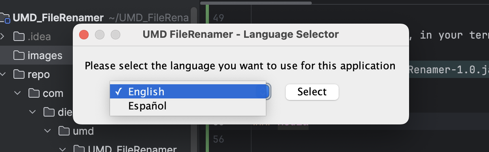
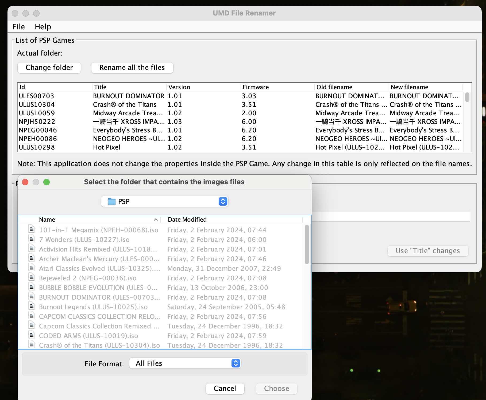
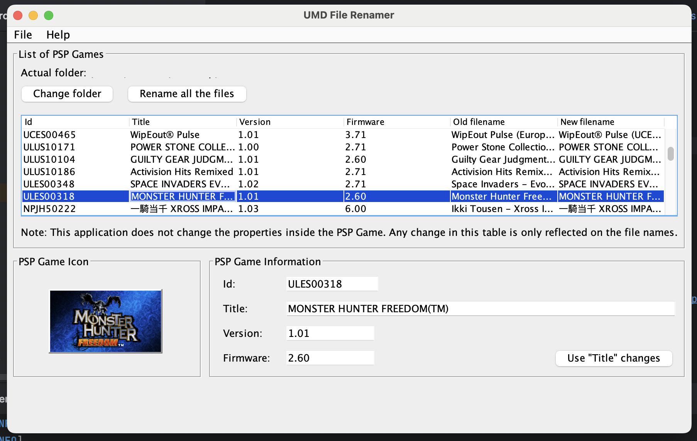
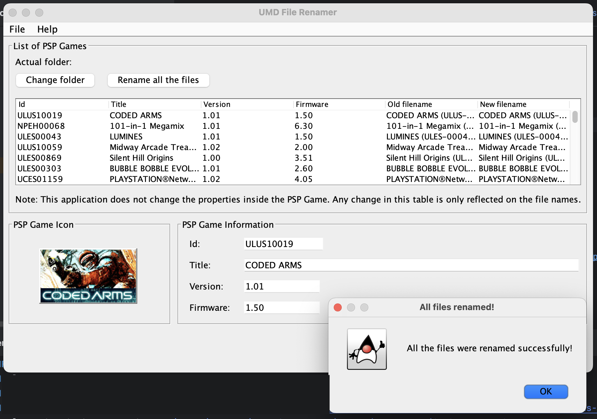

# UMD File Renamer 1.0.2

### Changes from the original:
Only tested on macOS!

- **Updated the log4j plugin version with the latest (safe) version and added the log4j core dependency.**                 
- **Updated all other plugins to their latest versions (LTS).**
- **Added some changes to the Maven pom.xml file to get rid of dependency errors.**                 
- **Refactored the code.**                   
- **Now uses Java OpenJDK21 to compile.**              
- **Changed branch-name from "master" to "main".**              
- **Fixed some typos.**       
- **Added JavaDocs to the build.**
- **Fixed a dependency error that prevented the app from running outside of the development environment.**

- **ToDo:**
  - Fix the Javadocs.
  - Fix the GUI code.

> **If making changes to the repository make sure to run `mvn clean package` and `mvn clean install` and/or use the Maven menu first before running the app again.         
> For recompile use `mvn clean compile`.**

> **Locate the app here: [UMD_FileRenamer](repo/com/diegohp/umd/UMD_FileRenamer/1.0.2/) or download from here: [latest](https://github.com/RobertoTorino/UMD_FileRenamer/releases/tag/v1.0.2).          
> To run the app on macOS, double-click on it or in your terminal type:** `java -jar UMD_FileRenamer-1.0.2.jar`.                   
> **[For the JavaDocs click here.](target/site/index.html)**                        

---

### Media

---

                      

---

                      

---

                  

---

## Official GitHub port

Hello, [Diego Hernández](https://github.com/iampeluca) here.  
I'm the original creator of the **UMD File Renamer** published on Google Code at https://code.google.com/archive/p/umd-file-renamer/ back on June 3rd, 2012. This is the first time I officially publish this code on GitHub.

Back on 2012, thanks to a couple of articles published by Softpedia (https://mac.softpedia.com/get/Games/UMD-File-Renamer.shtml and another link broken by now), we were able to record more than 300 downloads!

This project will be rebranded using `BrosMakingSoftware` name, in order to keep it alive and add improvements to it.

Thanks everyone for the support, I really appreciate it.  
I hope this application can help you keep your game collection organized.

## Original description

This application reads ISO or CSO files and extract their information to generate a recognized and standard file name, without changing the properties inside the PSP games. Some classes of jpcsp project are used, jpcsp is an open source Java emulator of PlayStation Portable console system.
See http://jpcsp.org/ for more information, code can be downloaded from http://code.google.com/p/jpcsp/. This application is partially based and inspired on [UmdBrowser](http://code.google.com/p/jumdbrowser/), an application to list and navigate into UMD images.

The code is written in Java using the latest Swing Layout library, so this desktop application can use the OS native interface (tested on Mac OSX, Windows and Linux/Ubuntu) and run on all of them. It comes in 2 languages: English and Spanish, you are able to choose it when the app starts. The IDE
used to create this project was Netbeans 7.1, but it is a Maven project, so you are able to open this project in any IDE that supports Maven. If you want to see a detailed log of the actions of the app, run it from a terminal (or console) and check the outputs (log4j was implemented for this
purpose).

Java JRE 6+ is required. All required libraries are included to be more portable.
